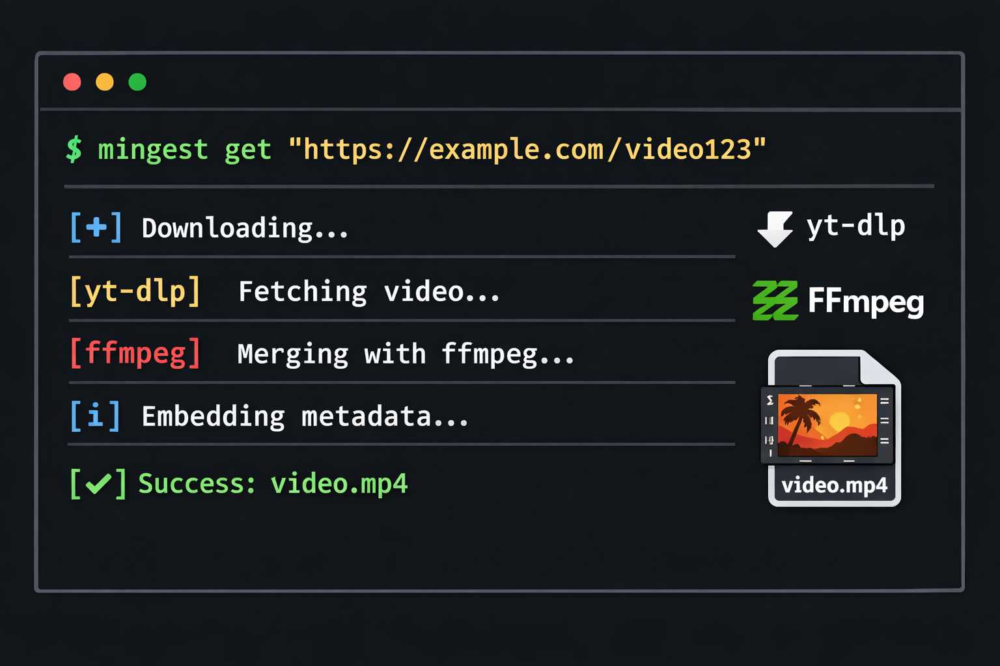

# Mingest (media-ingest)



**Mingest 是一个本地运行的视频归档工具**：输入 URL，自动调用 `yt-dlp` 下载，并默认合并为 `mp4`（嵌入封面与元数据）。遇到需要登录/会员/额外验证（例如年龄确认）的内容，可用一键 `auth` 交互登录 + cookies 缓存把门槛降到最低。

> 合规提示：Mingest 仅用于下载/归档你拥有版权或已获授权、或在法律与平台规则允许范围内可保存的内容。它不提供任何内容，不提供在线解析/代下服务，也不支持绕过 DRM 等技术保护措施。更多见：
> [docs/LEGAL.md](docs/LEGAL.md)。

```bash
mingest get "https://www.youtube.com/watch?v=******"
mingest get "https://www.bilibili.com/bangumi/play/ss******"
mingest get "https://www.bilibili.com/bangumi/play/ep******"
```

说明：

- 站点/格式支持最终取决于 `yt-dlp` 本身
- 当前内置平台：`youtube`、`bilibili`

## 能做什么

- 自动检测并调用：`yt-dlp`、`ffmpeg`/`ffprobe`、`deno|node`
- 默认下载并合并为 `mp4`，附带元数据并嵌入封面
- 自动维护 **cookies 缓存**（优先使用；必要时从浏览器读取 cookies 刷新登录状态）
- Windows 下 Chrome cookies 读取失败时：自动尝试 **CDP**（让 Chrome 在进程内导出明文 cookies，避免读取/解密数据库）
- 自动维护素材索引（`asset_id`），支持 `mingest ls` 检索
- 支持 `mingest prep` 生成字幕/片段候选与 `prep-plan.json`
- 支持 `mingest export` 导出到 Premiere / Resolve / CapCut（可选 `zip`）
- 支持 `mingest doctor` 做导出前质量闸门（时长、重叠、字幕覆盖、边界切断、重复度）
- 支持 `mingest semantic` 语义候选流水线（A-E）：候选生成 -> GPT 重排 -> 约束选段 -> 评审包 -> 写回+doctor

## 快速开始

1. 下载 Release 的可执行文件（见 GitHub Releases）
2. 下载视频：

```bash
mingest get "<url>"
```

3. 需要登录时（例如大会员、年龄确认、风险提示），先执行一次交互登录：

```bash
mingest auth youtube
mingest auth bilibili
```

## 安装

推荐优先使用包管理器安装：

### Homebrew（macOS / Linux）

```bash
brew tap mingesthq/tap
brew install mingest
```

### Winget（Windows）

```powershell
winget install Mingest.Mingest
```

若你暂时不使用包管理器，也可以直接下载 GitHub Release 的产物。

- `*_slim`：不内置工具，需要你自己装 `yt-dlp`、`ffmpeg`/`ffprobe`、`deno|node`
- `*_bundled`：内置 `yt-dlp`、`ffmpeg`/`ffprobe`、`deno`（开箱即用，体积更大；含 `THIRD_PARTY_LICENSES` 满足各组件许可归属）

说明：

- 当前推荐安装渠道：`brew`、`winget`
- 首版分发默认不含系统签名/公证，系统安全提示属于预期行为

## 用法

下载：

```bash
mingest get "<url>"
```

查看素材索引：

```bash
mingest ls --limit 20
```

预处理（生成片段候选与字幕产物）：

```bash
mingest prep <asset_ref> --goal shorts
```

导出到剪辑软件：

```bash
mingest export <asset_ref> --to capcut --zip
```

导出前诊断：

```bash
mingest doctor <asset_ref> --target shorts --strict
```

语义候选流水线（默认生成评审包，不直接改 `prep-plan`）：

```bash
mingest semantic <asset_ref> --target shorts
```

应用评审结果并写回 `prep-plan`：

```bash
mingest semantic <asset_ref> --target shorts --apply --decisions <path/to/review-decisions.json>
```

交互登录（一次性准备登录信息，写入 cookies 缓存）：

```bash
mingest auth <platform>
```

支持的平台：

- `youtube`
- `bilibili`

## 登录信息与 cookies（自动模式）

cookies 缓存文件（按平台分别保存）：

- Windows：`%LOCALAPPDATA%\\mingest\\youtube-cookies.txt` / `%LOCALAPPDATA%\\mingest\\bilibili-cookies.txt`
- macOS / Linux：位于 `os.UserConfigDir()/mingest/` 下的同名文件

默认行为（每次 `mingest get`）：

- 优先使用 cookies 缓存（避免频繁读取浏览器数据）
- 若缓存失效/缺失：按顺序从浏览器读取并刷新（默认顺序 `chrome -> firefox -> chromium -> edge`，失败会自动切换）
- 为避免“未登录的浏览器覆盖掉已登录缓存”，浏览器导出的 cookies 会先写入临时文件；检测到有效登录信号后才会更新缓存

`mingest auth <platform>` 行为：

- 启动一个工具专用的 Chrome profile（位于状态目录下的 `mingest/chrome-profile`）
- 你在弹出的 Chrome 窗口完成登录后回到终端按回车
- 工具从 Chrome 进程内导出 cookies，写入该平台的 cookies 缓存文件

Windows 常见情况：

- `--cookies-from-browser chrome` 可能因为数据库锁定 / DPAPI / App-Bound Encryption 失败
- 工具会在 Chrome 失败后自动走 CDP（无需 DPAPI 解密）

## 隐私与安全

- 全程本地运行：不提供在线解析/代下服务，视频文件与账户登录信息均不会经过我们的服务器
- cookies 仅保存在你的本机，你可以随时删除（见上面的缓存路径）
- 为减少隐私暴露，工具会把 cookies 缓存过滤为与目标站点相关的域名

更多见：[docs/PRIVACY.md](docs/PRIVACY.md)。

## 可用环境变量覆盖

- `MINGEST_BROWSER=chrome|firefox|chromium|edge`
- `MINGEST_BROWSER_PROFILE=Default|Profile 1|...`
- `MINGEST_JS_RUNTIME=node|deno`
- `MINGEST_CHROME_PATH=C:\\Path\\To\\chrome.exe`
- `MINGEST_OPENAI_API_KEY` / `OPENAI_API_KEY`
- `MINGEST_OPENROUTER_API_KEY` / `OPENROUTER_API_KEY`
- `MINGEST_OPENROUTER_BASE_URL`（默认 `https://openrouter.ai/api/v1`）
- `MINGEST_LLM_MODEL`（如 `gpt-4.1-mini` 或 `openai/gpt-4.1-mini`）

## 依赖查找顺序

每个依赖（`yt-dlp`、`ffmpeg`、`ffprobe`、`deno`、`node`）按以下顺序查找：

1. 内置（`-tags embedtools` 构建时嵌入的工具）
2. 当前工作目录（你运行 `mingest` 的目录）
3. 程序所在目录
4. 系统 `PATH`

## 默认下载参数

当前固定为：

- `--output "%(title)s.%(ext)s"`
- `--embed-thumbnail`
- `--add-metadata`
- `-f "bestvideo[vcodec^=avc1]+bestaudio[ext=m4a]/best[ext=mp4]/best"`
- `--merge-output-format mp4`

## 退出码

- `20` `AUTH_REQUIRED`：需要登录
- `21` `COOKIE_PROBLEM`：cookies 读取/解密/数据库占用问题
- `30` `RUNTIME_MISSING`：`deno|node` 不可用
- `31` `FFMPEG_MISSING`：`ffmpeg`/`ffprobe` 不可用
- `32` `YTDLP_MISSING`：`yt-dlp` 不可用
- `40` `DOWNLOAD_FAILED`：下载失败（其它原因）
- `41` `DOCTOR_FAILED`：`doctor` 检查未通过（存在 FAIL 项）
- `42` `SEMANTIC_FAILED`：`semantic` 流程执行失败

## 常见问题

1. 提示需要登录/会员/验证

- 先在浏览器确认账号可正常观看
- 再执行：`mingest auth youtube` / `mingest auth bilibili`
- 若是“额外确认”（例如年龄确认/风险提示/会员提示），建议在 `auth` 打开的窗口中打开目标视频并完成确认后再回车

2. Windows：`Could not copy Chrome cookie database` / `Failed to decrypt with DPAPI`

- 这是 Chrome 数据库锁定或加密策略导致，工具会自动尝试 CDP
- 若仍失败：请先彻底退出浏览器后重试，或切换到 Firefox（见 `MINGEST_BROWSER=firefox`）

3. Linux：提示 `ffprobe not found`

- 说明你用的是 `*_slim` 且系统/目录里只有 `ffmpeg` 没有 `ffprobe`
- 换用 `*_bundled`，或确保 `ffprobe` 与 `ffmpeg` 同目录可用

更多问答见 [docs/FAQ.md](docs/FAQ.md)。

## 包管理器发布（维护者）

本仓库内置了用于生成 Homebrew / winget 清单的脚本与工作流：

- 脚本：
  - `scripts/generate-homebrew-formula.sh`
  - `scripts/generate-winget-manifests.sh`
- 工作流：
  - `.github/workflows/publish-homebrew.yml`
  - `.github/workflows/publish-winget.yml`

默认行为：

- 每次发布 tag（`v*`）后，工作流会基于 `SHA256SUMS.txt` 生成 Formula / manifests 并上传为 artifacts
- 若配置了对应 secrets，会自动尝试创建 PR
- Homebrew 首次发布若 tap 为空仓库，会先自动初始化 `main` 分支（直推首个 `Formula/mingest.rb`）；后续版本走 PR 流程

Homebrew 自动 PR 所需 secrets：

- `HOMEBREW_TAP_GH_TOKEN`：可写目标 tap 仓库的 token
- `HOMEBREW_TAP_REPO`：目标 tap 仓库（可选，默认 `mingesthq/homebrew-tap`）

winget 自动 PR 所需 secrets：

- `WINGET_GH_TOKEN`：可写你自己 winget-pkgs fork 的 token
- `WINGET_FORK_REPO`：你的 fork 仓库（例如 `yourname/winget-pkgs`）

更多细节见 [docs/PACKAGING.md](docs/PACKAGING.md)。

## 从源码构建

默认（不嵌入工具）：

```bash
go build -o dist/mingest ./cmd/mingest
```

打包内置工具（推荐用于分发）：

```bash
scripts/fetch-embed-tools.sh --os <goos> --arch <goarch>
go build -tags embedtools -o dist/mingest ./cmd/mingest
```

说明：

- 工具下载目录：`ingest/embedtools/assets/<goos>/`
- 获取 `ffmpeg` 时会一并获取 `ffprobe`
- GitHub Actions 工作流见 `.github/workflows/build-and-release.yml`

## 许可证

本项目采用 [GNU Affero General Public License v3.0 (AGPL-3.0)](LICENSE) 开源协议。  
Copyright (C) 2026 Harrison Wang <https://mingest.com>

`*_bundled` 版本内置的 yt-dlp、ffmpeg/ffprobe、deno 为独立第三方组件，其版权与许可见 [THIRD_PARTY_LICENSES](THIRD_PARTY_LICENSES)。
